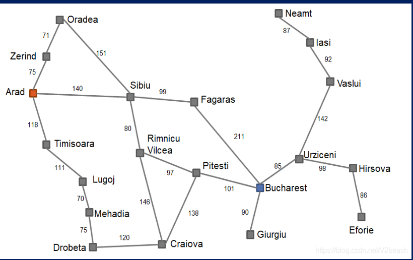

# 人工智能导论实验一

---

## 1. TODO

* 使用广度优先搜索、深度优先搜索和A*算法实现**罗马尼亚度假问题**

* Graph is given

  

* other information is shown in Data

---

## 2.Target

* 三个算法实现
* 算法复杂度及其其他的分析

## 3.复杂度分析
### 3.1 DFS

* stack的空间复杂度为O(V)
* 时间代价O(V+E)

### 3.2 BFS

* queue的空间复杂度O(V)
* 时间代价O(V+E)

## 4.Usage

* run main.py
* 输入 A or B 来选择参数传入模式
* 输入起点城市和终点城市